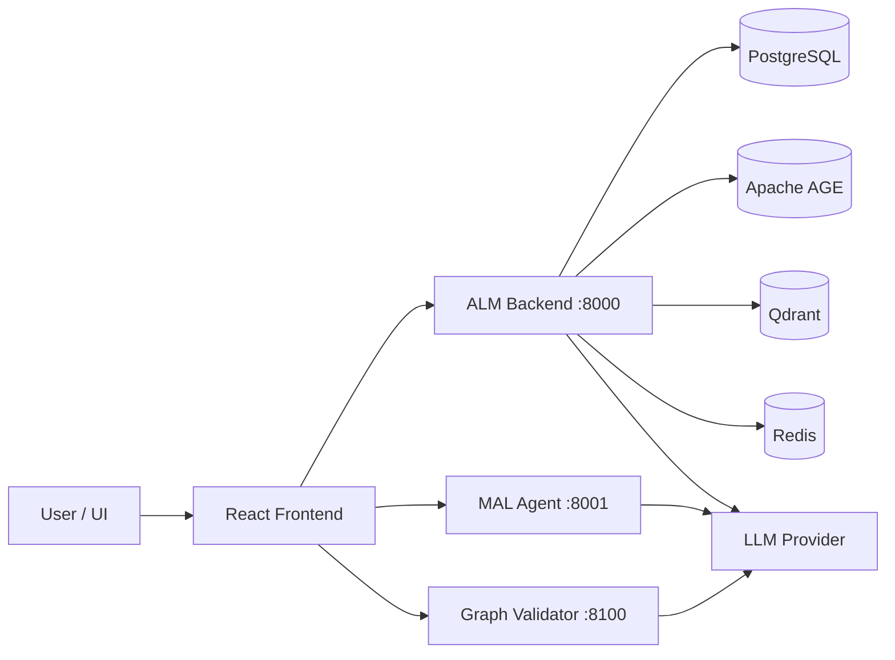

# ALM Project Master Overview

## Purpose

This file is the master understanding document for the ALM project based primarily on the actual repository:

- `Application-Development-Model/`

Secondary context:

- `AML PROJECT TRANSCRIPT.txt`
- `ALM_Summary_v1.pptx.url`

The repository is the most reliable source here, so this document is now repo-grounded rather than inference-driven.

## One-Line Summary

ALM is an AI-assisted application modeling platform that converts user intent into `MAL` (Metafore Application Language), validates the generated design, stores versioned artifacts, compiles them into a knowledge graph, and supports deterministic as well as LLM-assisted workflows through a multi-service architecture.

## What The Project Actually Does

At a practical level, this system is trying to let a user describe an application or a change in natural language and turn that into a structured application specification.

That specification is expressed in `MAL`, a domain-specific language used to define:

- entities
- workflows
- screens
- policies
- integrations

The generated MAL can then be:

- validated
- versioned
- compiled into a graph representation
- queried for context during future modifications
- repaired when validation fails

This makes ALM more than a chat assistant. It is a full application modeling pipeline with storage, retrieval, validation, and graph-based reasoning.

## Core Concept: MAL

`MAL` stands for `Metafore Application Language`. It is the central artifact of the whole system.

According to `Application-Development-Model/ALM/docs/mal_grammar-spec.md`, MAL is a prototype DSL for defining enterprise application structure. It supports constructs such as:

- `entity`
- `workflow`
- `screen`
- `policy`
- `integration`

The long-term idea is:

1. take user intent
2. generate MAL
3. validate MAL
4. compile MAL into a knowledge graph
5. use stored graph and previous versions to guide future generation

## High-Level System Shape

The repository is a monorepo with several cooperating services:

### 1. ALM Backend

Location:

- `Application-Development-Model/backend/`

Technology:

- FastAPI

Role:

- Main API service
- Project and MAL storage
- deterministic intent parsing
- generation orchestration
- validation, compilation, graph, deployment, repair, admin endpoints

Default host port:

- `8000`

### 2. MAL Agent

Location:

- `Application-Development-Model/app/`

Technology:

- FastAPI

Role:

- LLM-facing service that converts user intent into MAL
- validates generated MAL
- builds AST output
- supports rebuild and prompt preview flows

Default host port:

- `8001`

### 3. Frontend SPA

Location:

- `Application-Development-Model/frontend/`

Technology:

- Vite
- React

Role:

- Main user interface
- proxies requests to both the backend and MAL Agent
- also integrates graph-validator routes

Default dev port:

- `5173`

### 4. Graph Validator

Location:

- `Application-Development-Model/graph-validator/`

Technology:

- FastAPI
- networkx

Role:

- validates MAL using graph-based checks and markdown rule packs
- produces scored compliance reports
- can generate targeted repair prompts for LLM-assisted fixes

Default host port:

- `8100`

### 5. Shared Infrastructure

Managed via `docker-compose.yml`:

- PostgreSQL as the system of record
- Apache AGE for graph storage inside PostgreSQL
- Qdrant for vector similarity search
- Redis for cache and orchestration state
- worker process for background tasks

## Architecture In One View

## Main Architectural Idea

The architecture is designed around different storage engines serving different access patterns:

- `PostgreSQL` is the structured source of truth
- `Apache AGE` stores the compiled application knowledge graph
- `Qdrant` stores embeddings for semantic retrieval
- `Redis` caches expensive context assembly and workflow state

This is not a simple CRUD app. It is a retrieval-plus-generation system where graph context, policy context, semantic similarity, and version history are all meant to influence future application generation and modification.

## Major Functional Capabilities

### Intent Handling

There are two intent paths in the repo:

- a deterministic parser in the backend
- an LLM-based MAL generation flow in the MAL Agent

The deterministic backend parser uses a strict grammar:

- `<VERB> <PROJECT_NAME> <INSTRUCTION>`

Supported verbs:

- `Create`
- `Modify`
- `Explain`

This directly addresses the concern seen in the transcript: the system needs safer, less ambiguous project resolution rather than guessing silently.

### MAL Generation

The MAL Agent takes user intent and:

- builds a prompt
- checks scope guardrails
- calls the LLM
- parses the LLM output
- returns assumptions, MAL, and validation output

It also supports:

- project-aware update and explain flows
- prompt preview without calling the model
- rebuild flows when validation errors exist
- downloadable rebuild prompt documents

### Validation

Validation happens in two forms:

1. MAL validation in the MAL Agent
2. graph-based policy/domain validation in the graph-validator service

The graph-validator checks multiple dimensions:

- structural correctness
- domain rules
- policy compliance
- workflow correctness
- screen concerns
- audit requirements
- integration safety

It produces a scored report and can block deployment on critical failures.

### Graph Compilation and Retrieval

The backend architecture describes a flow where MAL is compiled into a graph representation. That graph is then used later for:

- subgraph retrieval
- dependency analysis
- module-scoped context
- policy-aware modification
- version-aware change impact reasoning

This means the project is designed to get smarter over time as more applications and versions are stored.

### Versioning and Auditability

The architecture explicitly uses immutable versions for:

- MAL documents
- policies
- prompts

Rollback is described as deploying a previous successful version forward, not mutating history. This is important because the platform is generating application definitions and needs traceability.

## End-to-End Product Flow

The repo documents three main generation modes:

### 1. Greenfield Synthesis

Used when building a new application from scratch.

Flow:

1. user submits raw intent
2. backend stores intent and embeddings
3. context builder assembles domain packs, patterns, and policies
4. generation service calls the LLM
5. MAL is validated
6. on success, MAL is compiled and persisted
7. graph and vector stores are updated

### 2. Guided Extension

Used when adding features to an existing application.

Extra context used:

- graph slice for selected modules
- current MAL fragments
- policy scope
- similar MAL patterns

### 3. Safe Modification

Used when changing an existing part of an application.

Extra context used:

- dependency subgraph
- version history
- change history
- affected MAL fragments
- policy nodes

This is the strongest sign that the project is aiming for controlled AI-assisted evolution, not just one-shot generation.

## Data Model Summary

The backend architecture describes 18 main PostgreSQL tables grouped into domains such as:

- applications and modules
- MAL documents and versions
- compile and validation runs
- policies and policy versions
- change requests and migrations
- generation and repair runs
- domain packs and pattern libraries
- deployment releases and audit logs

The graph model contains nodes such as:

- `Application`
- `Module`
- `Entity`
- `Workflow`
- `Interface`
- `Screen`
- `Component`
- `Policy`
- `Role`
- `Integration`
- `Event`
- `Version`
- `ChangeRequest`

Key edge types include:

- `HAS_MODULE`
- `HAS_ENTITY`
- `HAS_WORKFLOW`
- `GOVERNED_BY`
- `DEPENDS_ON`
- `VISIBLE_TO`
- `CHANGED_BY`
- `PREVIOUS_VERSION`
- `AFFECTS`

## Vector and Retrieval Design

The architecture uses `Qdrant` with multiple collections, including embeddings for:

- user intents
- domain packs
- MAL document chunks
- graph nodes
- change requests
- pattern library entries

This is effectively a RAG-style design, but not only over documents. It mixes:

- relational records
- graph slices
- vector similarity
- cached assembled context

That is one of the defining characteristics of the project.

## Why The Repo Has Two Intent Paths

This is one of the most important things to understand about the system.

### Deterministic path

Implemented in the backend, this is for strict and safe parsing of user commands such as:

- `Create MyApp Build customer onboarding workflow`
- `Modify CRMApp Add approval step to invoice workflow`
- `Explain CRMApp Explain invoice approval workflow`

This path does not rely on an LLM for parsing. It uses grammar, validation, business rules, and project lookup.

### LLM path

Implemented in the MAL Agent, this is for richer natural-language conversion into MAL and related rebuild/explain flows.

Together, these two paths suggest the platform is balancing:

- reliability and control
- flexibility and expressive generation

That lines up very closely with the transcript concerns around ambiguity, misspelling, dashboard assistance, and compliance.

## Frontend Behavior

The frontend is not tied to a single backend. `frontend/vite.config.ts` makes it clear that the SPA proxies to multiple services:

- `/api/v1` to the ALM backend
- `/api`, `/generate-mal`, `/validate-mal`, `/generate-ast` to the MAL Agent
- policy repair and validation routes to the graph-validator

This means the UI is acting as a workspace over several backend capabilities rather than a thin client over one API.

## Deployment and Local Development

The standard development story is Docker-first.

Core services:

- `postgres`
- `qdrant`
- `redis`
- `backend`
- `worker`
- `mal-agent`
- `graph-validator`
- `frontend`

Useful defaults:

- backend on `8000`
- mal-agent on `8001`
- graph-validator on `8100`
- frontend on `5173`

The repo also provides:

- `scripts/dev-up.ps1`
- smoke tests for the deterministic intent parser
- backend tests
- graph-validator tests

## Compliance and Safety Position

Even though the repo is technical, it reflects strong governance concerns:

- immutable versioning
- repair loops instead of silent overwrites
- policy validation
- audit logs
- deployment blocking on critical rule failures
- deterministic parsing for sensitive operations

The transcript's concern about unsafe auto-correction is consistent with the repo design. The project is moving toward explicit resolution and traceable execution rather than hidden agent guesses.

## Domain Focus

The repo is not hardcoded to only one vertical, but several clues point to telecom-oriented validation and policy examples:

- `telecom_india_domain_policy_rules.md`
- telecom fixtures in the validator
- transcript examples using `Jio` and `Airtel`

So the platform appears to be a generic ALM system demonstrated with telecom-flavored policy and workflow examples.

## Current Maturity Assessment

Based on the repository, the project is in a strong prototype or Phase 1 platform state:

- architecture is well thought out
- services and responsibilities are clearly separated
- storage strategy is explicit
- deterministic parsing exists
- graph validator is substantial
- UI integration exists

But some parts are still transitional:

- some services are scaffolded for future scale-out
- graph and retrieval behavior is more mature in architecture docs than in every code path
- the MAL language is still called a prototype grammar
- some validation and repair behavior is designed for extension over time

## Key Files To Read First

If someone wants to understand the project quickly, these are the best entry points:

- `Application-Development-Model/README.md`
- `Application-Development-Model/ARCHITECTURE.md`
- `Application-Development-Model/backend/README.md`
- `Application-Development-Model/graph-validator/README.md`
- `Application-Development-Model/ALM/docs/mal_grammar-spec.md`
- `Application-Development-Model/docker-compose.yml`
- `Application-Development-Model/frontend/vite.config.ts`
- `Application-Development-Model/app/main.py`
- `Application-Development-Model/backend/app/api/router.py`

## Best Overall Interpretation

ALM is an application design operating system built around a domain-specific language called MAL. It combines deterministic intent parsing, LLM-based MAL generation, graph-aware retrieval, vector search, compliance validation, and immutable versioning so that teams can create and evolve enterprise applications in a controlled way.

The system is not just "chat over files." It is a structured platform for turning intent into application models, validating those models, storing them safely, and using prior application knowledge to guide future change.

## Practical Takeaway

If you need to explain this project in simple words:

`This repo builds an AI-assisted platform that turns business intent into a structured application language, validates it against domain and policy rules, stores versions safely, and uses graph plus vector context to support future application evolution.`

## Source Basis

Primary source:

- `Application-Development-Model/README.md`
- `Application-Development-Model/ARCHITECTURE.md`
- `Application-Development-Model/backend/README.md`
- `Application-Development-Model/graph-validator/README.md`
- `Application-Development-Model/ALM/docs/mal_grammar-spec.md`
- `Application-Development-Model/docker-compose.yml`
- `Application-Development-Model/frontend/vite.config.ts`
- `Application-Development-Model/app/main.py`
- `Application-Development-Model/backend/app/api/router.py`

Secondary source:

- `AML PROJECT TRANSCRIPT.txt`
